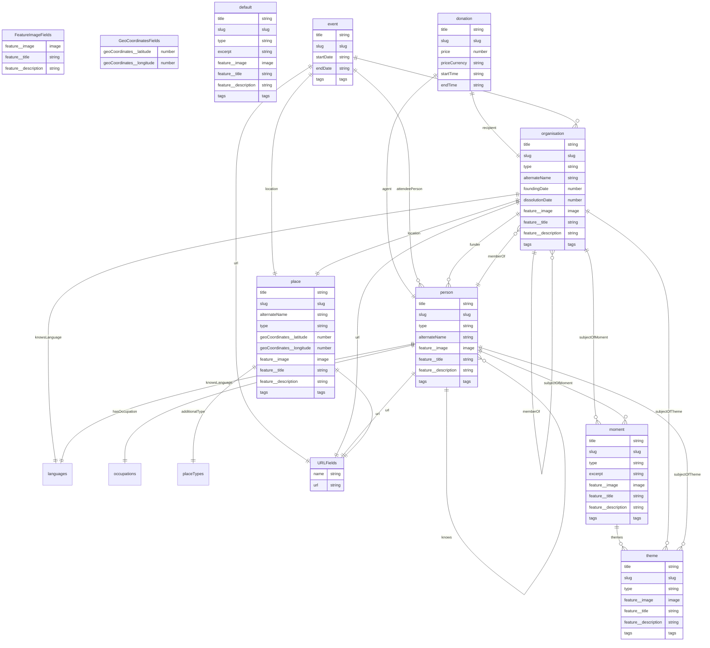

# King's Past

[](https://gitpod.io/#https://github.com/kingsdigitallab/kings-past/tree/develop)

## Set up

### Dependencies

- [Node](https://nodejs.org/) 20

Install the node packages:

```bash
npm install
```

Install the git hooks:

```bash
npx simple-git-hooks
```

## Developing

```bash
npm run dev

# or start the server and open the app in a new browser tab
npm run dev -- --open
```

## Building

To create a production version of your app:

```bash
npm run build
```

You can preview the production build with `npm run preview`.

## Data model

The data model was automatically generated from the frontmatter content types,
unsing the frontmaid package in this repository.


