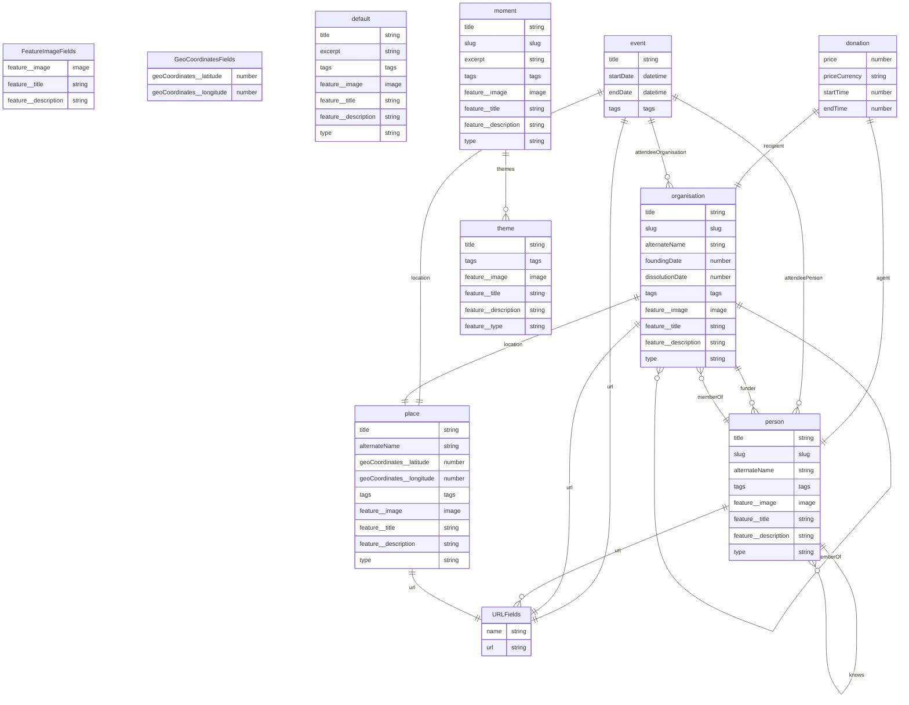

# kings-past

[](https://gitpod.io/#https://github.com/kingsdigitallab/kings-past/tree/develop)

## Set up

### Dependencies

- [Node](https://nodejs.org/) 18

Install the node packages:

```bash
npm install
```

Install the git hooks:

```bash
npx simple-git-hooks
```

## Run the project

```bash
npm run frontend:dev
```

## Data model

The data model was automatically generated from the frontmatter content types,
unsing the frontmaid package in this repository.


